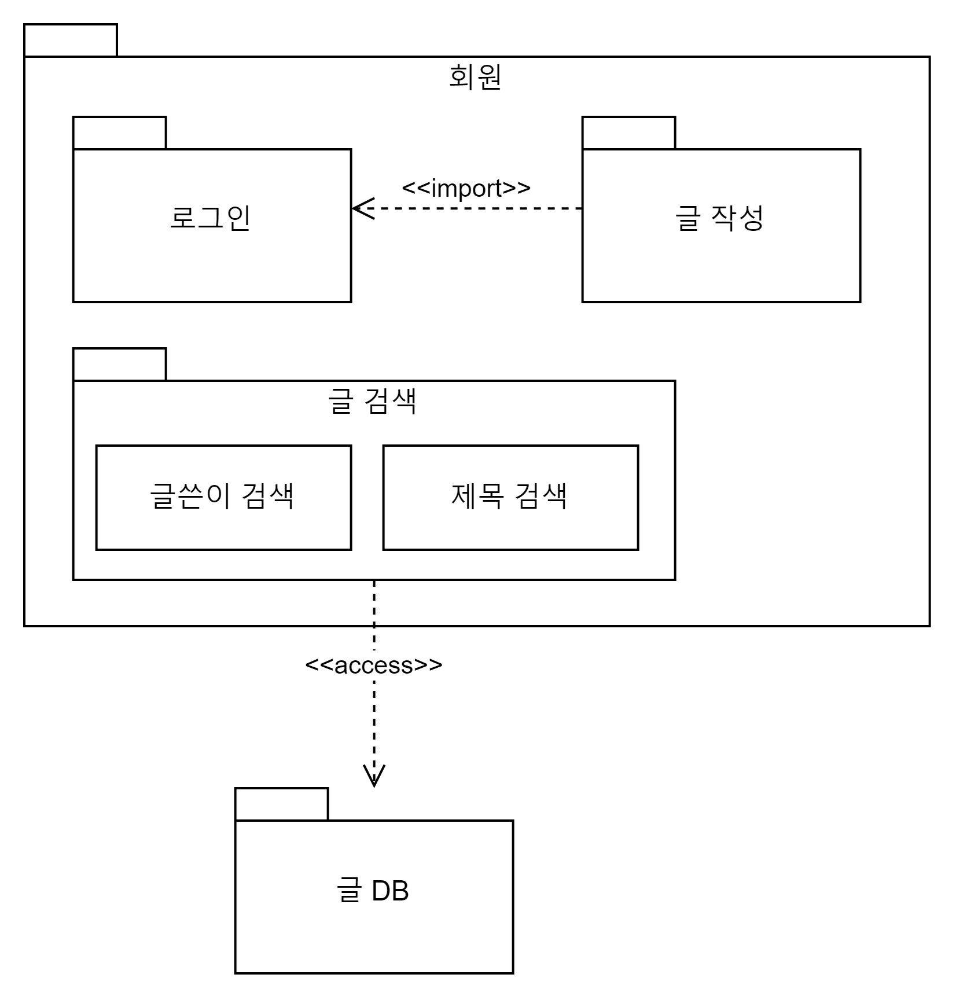

# 소프트웨어공학 

## 목차

- [소프트웨어 개발 방법론](#소프트웨어-개발-방법론)
  - [Waterfall](#waterfall)
  - [V자 모델](#v자-모델)
  - [Prototype](#prototype)
  - [Spiral](#spiral)
  - [애자일(Agile) 방법론](#애자일agile-방법론)
  - [XP; eXtreme Programming](#xp-extreme-programming)
  - [스크럼(Scrum)](#스크럼scrum)
- [프로젝트 관리](#프로젝트-관리)
  - [프로젝트 관리 요소](#프로젝트-관리-요소)
  - [CPM (Critical Path Method)](#cpm-critical-path-method)
  - [PERT (Program Evaluation and Review Technique)](#pert-program-evaluation-and-review-technique)
  - [COCOMO 모형](#cocomo-모형)
  - [간트 차트](#간트-차트)
  - [비용산정화추정도구](#비용산정화추정도구)
  - [프로젝트 관리 법칙](#프로젝트-관리-법칙)
- [요구사항 정의](#요구사항-정의)
  - [요구사항 유형](#요구사항-유형)
  - [요구사항 개발 프로세스](#요구사항-개발-프로세스)
- [요구사항 분석](#요구사항-분석)
  - [자료 흐름도(DFD; Data Flow Diagram)](#자료-흐름도dfd-data-flow-diagram)
  - [자료사전 (DD; Data Dictionary)](#자료사전-dd-data-dictionary)
  - [HIPO](#hipo)
- [요구사항 검증](#요구사항-검증)
  - [정형 기술 검토(FTR; Formal Technical Review)](#정형-기술-검토ftr-formal-technical-review)
- [객체지향 분석](#객체지향-분석)
  - [럼바우(Rumbaugh)의 분석 기법](#럼바우rumbaugh의-분석-기법)
- [UML](#uml)
  - [UML 개요](#uml-개요)
  - [UML 다이어그램 분류](#uml-다이어그램-분류)
  - [클래스 다이어그램 관계](#클래스-다이어그램-관계)
  - [상태 다이어그램 구성 요소](#상태-다이어그램-구성-요소)
  - [순차 다이어그램 구성 요소](#순차-다이어그램-구성-요소)
  - [액티비티 다이어그램 구성 요소](#액티비티-다이어그램-구성-요소)
  - [유스케이스 다이어그램](#유스케이스-다이어그램)
  - [패키지 다이어그램](#패키지-다이어그램)
- [소프트웨어 설계](#소프트웨어-설계)
  - [추상화](#추상화)
  - [McCabe 순환 복잡도](#mccabe-순환-복잡도)
  - [나시-슈나이더만(Nassi-Shneiderman) 차트](#나시-슈나이더만nassi-shneiderman-차트)
  - [아키텍처](#아키텍처)
  - [UI](#ui)
- [모듈](#모듈)
  - [결합도](#결합도)
  - [응집도](#응집도)
  - [Fan In, Fan Out](#fan-in-fan-out)
- [디자인 패턴](#디자인-패턴)
  - [생성 패턴](#생성-패턴)
  - [구조 패턴](#구조-패턴)
  - [행위 패턴](#행위-패턴)
- [인터페이스](#인터페이스)
  - [인터페이스 데이터 표쥰](#인터페이스-데이터-표쥰)
- [소프트웨어 개발](#소프트웨어-개발)
  - [코드 종류](#코드-종류)
- [소프트웨어 테스팅](#소프트웨어-테스팅)
  - [개념](#개념)
  - [오류 유형](#오류-유형)
  - [화이트박스 테스트](#화이트박스-테스트)
  - [블랙박스 테스트](#블랙박스-테스트)
  - [하향식 통합 테스트](#하향식-통합-테스트)
  - [상향식 통합 테스트](#상향식-통합-테스트)
- [소프트웨어 표준](#소프트웨어-표준)
  - [품질 표준](#품질-표준)
  - [프로세스 표준](#프로세스-표준)
- [소프트웨어개발도구](#소프트웨어개발도구)
  - [테스트 자동화 도구](#테스트-자동화-도구)
  - [코드 분석 도구](#코드-분석-도구)
  - [코드 커버리지 분석 도구](#코드-커버리지-분석-도구)
  - [빌드 자동화 도구](#빌드-자동화-도구)
  - [CASE](#case)

---

## 소프트웨어 개발 방법론

### Waterfall 

* 구조적 방법론

### V자 모델 

* 구조적 방법론

### Prototype

* 구조적 방법론

### Spiral

* 구조적 방법론

### 애자일(Agile) 방법론 

* 짧은 주기로 동작하는 소프트웨어를 지속적으로 제공
* 고객 협업·변화 대응을 계획·문서보다 우선

### XP; eXtreme Programming

* 애자일 방법론
* 켄트 벡(Kent Beck)이 제안. 소규모 팀, 빠른 변화 요구사항에 적합
* 핵심 가치: 의사소통(Communication), 단순성(Simplicity), 피드백(Feedback), 용기(Courage), 존중(Respect)

**주요 실천 방법(Practice)**

| 실천 방법 | 설명 |
|-----------|------|
| **짝 프로그래밍(Pair Programming)** | 두 명이 한 컴퓨터로 개발. 실시간 코드 리뷰 |
| **테스트 주도 개발(TDD)** | 코드 작성 전 테스트 코드 먼저 작성 |
| **지속적 통합(CI)** | 하루에도 여러 번 코드 통합·빌드·테스트 |
| **리팩토링(Refactoring)** | 기능 변경 없이 코드 구조 개선 |
| **소규모 릴리즈(Small Release)** | 짧은 주기로 자주 배포 |
| **공동 코드 소유(Collective Ownership)** | 모든 팀원이 모든 코드 수정 가능 |
| **코딩 표준(Coding Standard)** | 팀 전체 동일한 코딩 규칙 준수 |
| **주 40시간 근무** | 초과 근무 금지. 지속 가능한 속도 유지 |
| **현장 고객(On-site Customer)** | 고객이 개발팀과 함께 상주하며 즉시 피드백 |
| **메타포(Metaphor)** | 시스템 전체를 설명하는 공통 비유 사용 |
| **단순 설계(Simple Design)** | 현재 요구사항만 만족하는 가장 단순한 설계 |
| **계획 게임(Planning Game)** | 고객·개발자 협력으로 릴리즈 범위·일정 결정 |

### 스크럼(Scrum)

* 애자일 방법론
* 짧은 반복 주기(스프린트)로 동작 가능한 소프트웨어를 점진적으로 개발

**주요 역할**

| 역할 | 설명 |
|------|------|
| **제품 책임자(Product Owner)** | 제품 백로그 관리, 우선순위 결정, 이해관계자 대표 |
| **스크럼 마스터(Scrum Master)** | 스크럼 프로세스 준수 지원, 장애 제거, 팀 보호 |
| **개발팀(Development Team)** | 자기 조직화된 팀. 스프린트 내 개발 담당 |

**스크럼 프로세스**

```
제품 백로그 → 스프린트 계획 → 스프린트(1~4주) → 스프린트 리뷰 → 스프린트 회고
                                    ↑                                      |
                                    └──────────────────────────────────────┘
```

**스프린트 내 이벤트**

| 이벤트 | 설명 |
|--------|------|
| **스프린트 계획(Sprint Planning)** | 스프린트 목표·작업 선정 |
| **일일 스크럼(Daily Scrum)** | 매일 15분, 어제·오늘·장애 공유 |
| **스프린트 리뷰(Sprint Review)** | 완성된 증분 시연, 이해관계자 피드백 |
| **스프린트 회고(Sprint Retrospective)** | 프로세스 개선점 도출 |

---

## 프로젝트 관리

### 프로젝트 관리 요소

* 3P
    * People: 프로젝트에 참여하는 인력. 개발자, 관리자, 고객, 사용자 등
    * Problem: 해결해야 할 문제와 목표. 요구사항, 범위, 제약 조건 등
    * Process: 문제 해결을 위한 절차와 방법. 개발 방법론, 일정, 품질 관리 등

### CPM (Critical Path Method)

* 프로젝트 완료까지 가장 긴 경로(임계 경로)를 찾아 **최소 완료 시간** 계산
* 작업 간 선후 관계와 소요 시간이 **확정적**일 때 사용
* 임계 경로 상의 작업은 여유 시간(Slack) = 0 → 지연 시 전체 프로젝트 지연

---

### PERT (Program Evaluation and Review Technique)

* 결정 경로, 작업에 대한 경계 시간, 작업 간 관련성 파악 가능
* 노드 + 간선 
* 낙관치(O), 비관치(P), 최빈치(M) → 기댓값 = `(O + 4M + P) / 6`
* 작업 소요 시간이 **불확실**할 때 사용. 

### COCOMO 모형

* Constructive Cost Model. Boehm이 제안한 소프트웨어 **비용 산정** 모형
* LOC(Lines of Code) 기반으로 개발 노력(Man-Month)·기간 추정

**프로젝트 유형 3가지**

* **Organic(조직형)**: 소규모 팀, 익숙한 환경, 단순 프로젝트. 5만 라인 이하
* **Semi-Detached(반분리형)**: 중간 규모, 혼합된 경험. 30만 라인 이하
* **Embedded(내장형)**: 복잡한 제약 조건, 하드웨어·소프트웨어 통합. 30만 라인 초과


> LOC 수 결정 → 유형 분류 → 공식 대입 → Man-Month·개발 기간 산출

### 간트 차트

* 프로젝트 일정을 **막대 그래프** 형태로 시각화
* 가로축: 시간, 세로축: 작업(Task)
* 각 작업의 시작·종료·진행률을 한눈에 파악 가능

### FP 모형 

- 소프트웨어 기능을 증대시키는 요인별로 가중치 부여 
- 가중치로 FP(기능 점수) 산출 후 비용 산정 
- 알브레히트가 제안 

---

### 비용산정 자동화 추정 도구

* SLIM: Rayleigh-Norden 곡선과 Putnam 예측 모델을 기초로하여 개발된 자동화 추정 도구 
* ESTIMACS: 다양한 프로젝트와 개인별 요소를 수용하도록 FP 모형을 기초로 하여 개발된 자동화 추정 도구 

---

### 프로젝트 관리 법칙

* **Brooks의 법칙**: 지연된 프로젝트에 인력 추가 투입 시 오히려 더 늦어짐
    * 신규 인력 교육 시간 + 커뮤니케이션 오버헤드 증가가 원인
    * "9명의 여자가 1달 만에 아이를 낳을 수 없다"

* **Parkinson의 법칙**: 업무는 주어진 시간을 꽉 채우도록 늘어남
    * 여유 일정이 많을수록 작업이 그 시간만큼 늘어짐

* **파레토 법칙 (80-20 법칙)**: 결함의 80%는 전체 모듈의 20%에서 발생
    * 핵심 20% 집중 테스트·관리가 효율적

* **Putnam 모형**: 소프트웨어 생명주기 전반에 걸쳐 인력 투입 분포를 Rayleigh 곡선으로 모델링. 시간-노력 트레이드오프 관계 정의

---

## 요구사항 정의

### 요구사항 유형 

* 기능 요구사항 
* 비기능 요구사항 
* 사용자 요구사항 
* 시스템 요구사항

### 요구사항 개발 프로세스 

* 도출(Elicitation) → 분석(Analysis) → 명세(Specification) → 확인(Validation) 

## 요구사항 분석

### 자료 흐름도(DFD; Data Flow Diagram) 

* 자료의 흐름을 도형 중심으로 기술

* AKA: 자료 흐름 그래프, 버블 차트 

* 구조적 분석 기법에 이용

* Process(⏺) Flow(→), Data Store(﹦), Terminator(▭)

### 자료사전 (DD; Data Dictionary)

* 자료 흐름도의 자료를 자세히 기술 

* AKA: Meta Data 

### HIPO

#### 개요

* Hierarchy Input Process Output 

* 시스템의 분석, 설계, 문서화에 사용되는 기법. 

* 기본 시스템 모델은 입력, 처리, 출력으로 구성. 

* 하향식 소프트웨어 개발을 위한 문서화 도구 

* 기호, 도표 사용으로 이해하기 쉽고 유지보수도 용이 

* 기능과 자료의 의존 관계 표현. 

#### HIPO Chart

* 시스템의 기능을 여러 개의 고유 모듈로 분할하여 인터페이스를 계층 구조로 표현한 것 

* 가시적 도표(도식 목차): 시스템의 전체적인 기능과 흐름을 보여주는 Tree 구조도

* 총체적 도표(총괄도표, 개요 도표): 프로그램을 구성하는 기능을 기술. 입력, 처리, 출력에 대한 정보 제공 

* 세부적 도표(상세 도표): 총체적 도표에 표시된 기능을 구성하는 기본 요소들을 상세히 기술 

## 요구사항 검증 

### 정형 기술 검토(FTR; Formal Technical Review) 

* 소프트웨어 기술자들에 의해 수행되는 소프트웨어 품질 보증 활동

* 오류 발견, 표준 준수 확인, 관리 가능한 개발 방법 확립이 목적

* 유형
    * 동료 검토(Peer Review): 작성자가 요구사항 설명, 동료들이 결함 발견

    * 워크스루(Walk Through): 검토 자료 미리 배포, 비공식 검토 회의

    * 인스펙션(Inspection)
      - 작성자 제외 전문가들이 공식 검토
      - 가장 효과적 
      - 프로그램 실행x 요구사항 명세서 확인 
      - 정적 테스트 시 활용

* 지침
    * 제품만 검토, 개발자 검토 X
    * 사전에 준비된 검토 목록 사용
    * 논쟁·반박 금지, 결과 서면 작성
    * 오류 수정은 검토 자리에서 하지 않음

## 객체지향 분석

### 럼바우(Rumbaugh)의 분석 기법

* 객체 모델링 기법(OMT; Object-Modeling Technique)이라고도 불린다. 

* 분석 활동 순서: 객체 모델링 → 동적 모델링 → 기능 모델링 

* 객체 모델링(정보 모델링): 시스템에서 요구되는 객체를 찾아 속성과 연산 식별 및 객체들 간의 관계를 규정. 객체 다이어그램 사용. 

* 동적 모델링: 시간의 흐름에 따른 객체들 간의 동적인 행위 표현. 상태 다이어그램 사용.

* 기능 모델링: 다수의 프로세스들 간 자료 흐름 처리 표현. 자료 흐름도(DFD) 사용 

## UML

### UML 개요

* Unified Modeling Language. 객체지향 소프트웨어 개발 시 산출물을 명세화·시각화·문서화하는 표준 모델링 언어
* 객체기술에 관한 국제 표준화 기구 OMG에서 표준으로 채택
* 구성 요소: 사물(Things), 관계(Relationships), 다이어그램(Diagrams)

### UML 다이어그램 분류

* **구조(정적) 다이어그램**
    * 클래스(Class): 클래스 속성·연산·클래스 간 관계 표현
    * 객체(Object): 클래스 인스턴스(객체)와 연관 표현
    * 컴포넌트(Component): 컴포넌트 구조·의존 관계 표현
    * 배치(Deployment): 하드웨어·소프트웨어 물리 배치 표현
    * 패키지(Package): 모델 요소를 패키지로 그룹화
    * 복합 구조(Composite Structure): 클래스·컴포넌트 내부 구조 표현

* **행위(동적) 다이어그램**
    * 유스케이스(Use Case): 사용자 관점 시스템 기능·행위자 관계 표현
    * 순차(Sequence): 객체 간 메시지 교환 시간 순서 표현
    * 통신(Communication): 객체 간 관계와 메시지 흐름 표현
    * 상태(State): 객체 상태 변화·전이 조건 표현
    * 활동(Activity): 처리 흐름·조건·병렬 처리 표현
    * 상호작용 개요(Interaction Overview): 여러 상호작용 다이어그램 묶어 흐름 표현
    * 타이밍(Timing): 객체 상태 변화와 시간 제약 표현

### 클래스 다이어그램 관계

**접근 제한자**

* `+` public
* `-` private
* `#` protected
* `~` package/default

**관계**

| 관계 | 기호 | 설명 |
|------|------|------|
| 연관(Association) | `─────` | 클래스 간 일반 관계 |
| 의존(Dependency) | `- - ->` | 한 클래스가 다른 클래스 사용 (짧은 관계) |
| 일반화(Generalization) | `──▷` | 상속 관계 (is-a) |
| 실체화(Realization) | `- -▷` | 인터페이스 구현 |
| 집합(Aggregation) | `──◇` | 부분-전체 관계, 독립 존재 가능 |
| 합성(Composition) | `──◆` | 강한 부분-전체 관계, 전체 소멸 시 부분도 소멸 |

### 상태 다이어그램 구성 요소

* 객체의 상태 변화와 사건에 따른 전이를 표현. 객체 생명주기 모델링에 적합

* 상태(State): 객체가 특정 조건을 만족하며 머무르는 상황
* 시작 상태(Initial State): 객체 생명주기 시작점. 채워진 원 `●`
* 종료 상태(Final State): 객체 생명주기 종료점. 원 안에 채워진 원 `⊙`
* 전이(Transition): 상태 간 이동. 화살표로 표현
* 이벤트(Event): 전이를 발생시키는 외부 자극이나 조건
* 가드 조건(Guard Condition): 전이가 수행되기 위한 조건. 대괄호로 표현
* 액션(Action): 전이 과정에서 실행되는 동작

### 순차 다이어그램 구성 요소

* 생명선(Lifeline): 객체의 생존 기간을 나타내는 수직선
* 활성화(Activation): 객체가 메시지 처리 중인 기간 (직사각형)
* 메시지(Message): 객체 간 호출·응답 (동기: 실선, 비동기: 열린 화살표)
* 자기 메시지(Self Message): 자기 자신에게 보내는 메시지

### 액티비티 다이어그램 구성 요소

* 처리 흐름·조건 분기·병렬 처리를 순서도처럼 표현. 비즈니스 프로세스·알고리즘 모델링에 적합

* 시작 노드(Initial Node): 채워진 원 `●` — 흐름 시작
* 종료 노드(Activity Final Node): 원 안에 채워진 원 `⊙` — 전체 흐름 종료
* 흐름 종료 노드(Flow Final Node): 원 안에 X `⊗` — 해당 흐름만 종료
* 액션(Action): 둥근 사각형 — 단일 작업 단위
* 결정 노드(Decision Node): 마름모 `◇` — 조건 분기 (하나의 입력, 여러 출력)
* 병합 노드(Merge Node): 마름모 `◇` — 여러 흐름을 하나로 합침
* 포크(Fork): 굵은 수평/수직 막대 — 병렬 흐름 시작 (하나 → 여럿)
* 조인(Join): 굵은 수평/수직 막대 — 병렬 흐름 동기화 (여럿 → 하나)
* 스윔레인(Swimlane): 책임 주체별 영역 구분. 어떤 액터가 어떤 액션 수행하는지 표현

> 결정·병합 노드 모양 동일(마름모) — 방향(입출력 수)으로 구분

### 유스케이스 다이어그램

**구성 요소**

| 요소 | 표기 | 설명 |
|------|------|------|
| **시스템(System)** | 사각형 박스 | 개발 대상 시스템 범위. 유스케이스는 박스 안, 액터는 박스 밖 |
| **액터(Actor)** | 사람 아이콘 | 시스템과 상호작용하는 외부 존재. 사람·외부 시스템 모두 가능 |
| **유스케이스(Use Case)** | 타원 | 시스템이 제공하는 기능 단위 |

**관계**

* 연관(Association): 액터와 유스케이스 연결 `─────`
* 포함(Include): 반드시 실행되는 공통 기능 분리. `- - <<include>> - ->`
* 확장(Extend): 특정 조건에서만 실행되는 선택적 기능. `- - <<extend>> - ->`
* 일반화(Generalization): 액터·유스케이스 간 상속 `───────▷`

### 패키지 다이어그램

* 클래스 요소들을 그룹하여 의존 관계를 표현. 



## 소프트웨어 설계

### 추상화

* 문제의 세부 사항은 숨기고 필요한 정보만 표현하는 설계 원리

| 유형 | 설명 |
|------|------|
| **과정 추상화(Procedural)** | 자세한 수행 과정 없이 이름·목적만 명시. 함수·프로시저 개념 |
| **데이터 추상화(Data)** | 데이터 세부 속성 없이 개념적으로만 표현. 추상 자료형(ADT) |
| **제어 추상화(Control)** | 제어 흐름 세부 구현 없이 개념적으로 표현. 반복·조건 구조 |

### McCabe 순환 복잡도

* 프로그램 논리적 복잡도 측정 지표. 테스트해야 할 최소 경로 수 = 독립적 경로 수

**계산 공식**

| 공식 | 설명 |
|------|------|
| `V(G) = E - N + 2` | E: 간선(Edge) 수, N: 노드(Node) 수 |
| `V(G) = P + 1` | P: 판단(조건) 노드 수 |
| `V(G) = 폐구역 수 + 1` | 제어 흐름 그래프의 닫힌 영역 수 |

> 복잡도 10 이하 권장. 높을수록 테스트·유지보수 어려움

### 나시-슈나이더만(Nassi-Shneiderman) 차트

* 구조적 프로그램의 논리 흐름을 **도형**으로 표현하는 설계 도구. 박스 차트(Box Chart)라고도 함
* goto 문 없는 구조적 프로그래밍 표현에 적합
* 순서도 대체 — GOTO 없이 순차·선택·반복만으로 표현
* 코드 변환이 용이 
* 작성하기 어려움

**구성 요소**

| 구조 | 표현 |
|------|------|
| **순차(Sequence)** | 위→아래 박스 나열 |
| **선택(Selection)** | 사각형을 대각선으로 나눠 조건 분기 표현 |
| **반복(Iteration)** | 반복 구간을 감싸는 L자형 박스 |

**특징**

* 제어 흐름 이해 쉽고 논리 오류 발견 용이
* 화살표 없음 → 흐름이 위→아래로만 진행
* 코드와 1:1 대응 가능


---

### 아키텍처 

* **Blackboard Pattern**: 공유 저장소(Blackboard)에 여러 전문 컴포넌트가 협력하여 해답 도출. AI·음성인식에 활용

* **Broker Pattern**: 분산 컴포넌트 간 통신을 브로커가 중개. 위치 투명성 제공

* **Client-Server Pattern**: 클라이언트가 서버에 서비스 요청. 서버는 요청 처리 후 응답

* **Event-Bus Pattern**: 이벤트 발행자·구독자·채널로 구성. 컴포넌트 간 직접 의존 없이 통신

* **Interpreter Pattern**: 특정 언어의 문법을 정의하고 해석기로 실행. SQL·정규식 처리

* **Layer Pattern**: 시스템을 계층으로 분리. 각 계층은 바로 아래 계층만 사용 (예: OSI 7계층)

* Master-Slave Pattern
  * Master가 Slave 제어
  * Master가 작업 분배(연산, 통신, 조정)
  * Slave들이 병렬 처리 후 결과 반환(데이터 수집)
  * 실시간  시스템에서 이용 

* **Model-View-Controller Pattern**: 데이터(Model)·UI(View)·제어 로직(Controller) 분리

* **Peer-To-Peer Pattern**: 각 노드가 클라이언트·서버 역할 동시 수행. 중앙 서버 없음

* **Pipe-Filter Pattern**: 데이터를 필터(처리 단계)와 파이프(연결)로 순차 처리. Unix 파이프 구조

### UI 

#### UI 정의 

* 사용자와 시스템 간 상호작용을 돕는 장치 및 소프트웨어 

#### UI 분야 

* 정보 제공과 전달
* 콘텐츠의 상세적 표현, 전체적 구성 
* 사용자가 편리하게 사용하게 하는 기능

## 모듈 

### 결합도 

* 모듈 간의 상호 의존 정도. 

* 결합이 강할 수록 소프트웨어 품질이 좋지 않다. 

* 결합도 강도: Data < Stamp < Control < External < Common < Content 

* Data Coupling: 다른 모듈을 호출할 때 매개 변수를 넘겨주고, 호출된 모듈의 데이터 처리 결과를 받는 방식의 결합 

* Stamp Coupling: 다른 모듈의 자료 구조 정보가 전달될 때의 결합 

* Control Coupling: 다른 모듈의 내부 논리적 흐름을 제어 요소를 전달하는 결합

* External Coupling: 외부에서 정의된 데이터 형식·프로토콜·인터페이스에 여러 모듈이 직접 의존하는 결합

* Common Coupling: 전역 데이터(Global Data)를 여러 모듈이 공유할 때의 결합 

* Content Coupling: 모듈 내부의 자료 참조/수정할 때의 결합 


### 응집도 

* 모듈 내부 요소의 관련 정도

* 응집도가 강할수록 소프트웨어 품질이 좋다. 

* 응집도 순서: Coincidental < Logical < Temporal < Procedural < Communication < Sequential < Functional 

* Coincidental Cohesion: 모듈 구성 요소가 크게 관련 없음 

* Logical Cohesion: 모듈 구성 요소의 분류가 유사함 

* Temporal Cohesion: 모듈 구성 요소의 호출 시간이 비슷함 

* Procedural Cohesion: 모듈 구성 요소가 순차적으로 실행됨 

* Communication Cohesion: 모듈 구성 요소의 입출력이 동일함 

* Sequential Cohesion: 모듈 구성 요소의 출력 값을 다른 활동의 입력으로 사용 가능함 

* Functional Cohesion: 모듈 내 구성 요소가 단일 문제와 연관됨


### Fan In, Fan Out

* **Fan In**: 특정 모듈을 호출하는 모듈 수. 높을수록 재사용성 높음
* **Fan Out**: 특정 모듈이 호출하는 모듈 수. 높을수록 복잡도·의존성 증가

> Fan In 높고 Fan Out 낮을수록 좋은 설계

---

## 디자인 패턴 

### 생성 패턴 

* **Abstract Factory**: 관련 객체군을 구체 클래스 지정 없이 생성하는 인터페이스 제공

* **Builder**: 복잡한 객체를 단계별로 분리 생성. 동일한 생성 과정으로 다른 결과물 생성 가능

* **Factory Method**: 객체 생성을 서브클래스에 위임. 어떤 클래스를 생성할지 서브클래스가 결정

* **Prototype**: 기존 객체를 복제(clone)하여 새 객체 생성

* **Singleton**: 클래스 인스턴스를 하나만 생성하고 전역 접근점 제공

### 구조 패턴 

* **Adapter**: 호환되지 않는 인터페이스를 변환하여 함께 동작하게 함

* **Bridge**: 추상화와 구현을 분리하여 독립적으로 확장 가능하게 함

* **Composite**: 객체를 트리 구조로 구성. 단일 객체와 복합 객체를 동일하게 처리

* **Decorator**: 객체에 동적으로 기능 추가. 서브클래스 없이 기능 확장

* **Facade**: 복잡한 서브시스템에 단순화된 인터페이스 제공

* **Flyweight**: 공유를 통해 다수의 유사 객체를 효율적으로 지원. 메모리 절약

* **Proxy**: 다른 객체에 대한 대리자·자리표시자 제공. 접근 제어·로깅·캐싱 등에 활용

### 행위 패턴 

* **Chain of Responsibility**: 요청을 처리할 수 있는 객체를 체인으로 연결. 처리 가능한 객체가 담당

* **Command**: 요청을 객체로 캡슐화. 실행 취소(undo)·큐잉·로깅 지원

* **Interpreter**: 언어의 문법을 클래스로 표현하고 해석

* **Iterator**: 컬렉션 내부 구조 노출 없이 순차적으로 요소 접근

* **Mediator**: 객체 간 직접 통신 대신 중재자를 통해 상호작용. 결합도 감소

* **Memento**: 객체의 이전 상태를 저장·복원. 캡슐화 유지

* **Observer**: 객체 상태 변화 시 의존 객체들에 자동 통지 (발행-구독)

* **State**: 객체 내부 상태에 따라 행동 변경. 상태를 클래스로 분리

* **Strategy**: 알고리즘군을 정의하고 캡슐화하여 교체 가능하게 함

* **Template Method**: 알고리즘 골격을 상위 클래스에 정의, 세부 단계는 서브클래스에서 구현

* **Visitor**: 객체 구조를 변경하지 않고 새로운 연산 추가. 데이터와 처리 분리

---

## 인터페이스

### 인터페이스 데이터 표쥰 

* 정의: 모듈 간 인터페이스에 사용되는 데이터 형식의 표준화 

* 모듈 각 인터페이스 데이터 표준 확인 순서 
  1. 데이터 인터페이스를 통해 인터페이스 데이터 표준을 확인 
  2. 인터페이스 기능을 통해 인터페이스 표준 확인 
  3. 데이터 인터페이스와 인터페이스 기능을 통해 최종 인터페이스 데이터 표준 확인
  
## 소프트웨어 개발 

### 코드 종류 

* **Alien Code**: 오래되어 담당자가 없고 이해하기 매우 어려운 코드

* **Bad Code**: 로직이 복잡하고 변수명·구조가 불명확하여 유지보수가 어려운 코드

* **Clean Code**: 가독성 높고 단순·명확하여 유지보수가 쉬운 코드

* **Spaghetti Code**: 제어 흐름이 복잡하게 얽혀 구조 파악이 어려운 코드

---

## 소프트웨어 테스팅

### 개념

* 확인: 사용자 중심, 요구사항 확인 

* 검증: 개발자 중심. 기능 수행 검증. 

* 테스트 케이스 
  * 요구사항 검증을 위한 입력, 실행 조건, 기대 결과 

  * 명세 기반 테스트의 설계 산출물 

  * 구성요소
    * 식별자: 테스트 케이스를 구분하는 고유 번호나 이름

    * 테스트 항목: 검증할 기능, 모듈, 요구사항

    * 테스트 데이터: 테스트 수행 시 입력하는 값

    * 테스트 조건: 테스트 시작 전에 만족해야 하는 상태나 환경

    * 테스트 결과: 테스트 수행 후 실제로 나온 결과

* 테스트 시나리오 
  * 테스트 케이스들의 집합 

* 테스트 오라클
  * 테스트 결과가 올바른지 판단하귀 위해 정의된 값 

  * 제한적 검증: 테스트 오라클을 모든 테스트 케이스에 적용할 수 없다 

  * 수학적 기법: 테스트 오라클 값을 수학적 기법을 이용해 구할 수 있다 

  * 자동화 기능: 프로그램의 실행, 결과, 커버리지 측정 등을 자동화할 수 있다

* 테스트 오라클의 종류 
  * 참 오라클: 모든 테스트 케이스의 기대 결과 제공. 모든 오류 검출 가. 

  * 샘플링 오라클: 몇 테스트 케이스에만 결과 제공 

  * 추정 오라클: 샘플링 오라클 + 나머지는 추정 

  * 일관성 오라클: 어플 변경 후 테스트 케이스 수행 전후 값이 동일한지 확인 

### 오류 유형

* Omission Error (누락 오류): 필요한 기능·요구사항 빠짐 
* Addition Error (첨가 오류): 불필요한 기능 추가됨 
* Commission Error (수행 오류): 잘못 구현
* Timing Error (타이밍 오류): 기능 수행 시점이 잘못됨 
* Speed Error (속도 오류): 처리 속도가 요구사항 미충족 
* Transcription Error (필사 오류): 입력•복사•기록 과정의 오기입 

### 화이트박스 테스트

* 프로그램 내부 구조, 논리 흐름, 소스 코드를 기준으로 테스트하는 기법

* 모듈 안의 제어 구조와 수행 경로를 검사하여 논리 오류, 조건 오류, 반복 오류 등을 발견

* 개발자 관점의 구조 기반 테스트로, 구현 내용을 알고 테스트 케이스를 설계

* 특징
  * 원시 코드의 모든 문장, 분기, 조건, 경로를 최소 한 번 이상 수행하도록 테스트

  * 소스 코드 내부 논리 검증에 효과적

  * 요구사항 누락처럼 구현되지 않은 기능 오류는 발견하기 어려움

* 주요 기법
  * 기초 경로 검사(Basis Path Testing): 제어 흐름 그래프를 이용해 독립 경로를 테스트

  * 제어 구조 검사(Control Structure Testing): 조건, 반복, 데이터 흐름 등 제어 구조를 중심으로 테스트

  * 조건 검사(Condition Testing): 조건식의 참·거짓 결과와 개별 조건을 테스트

  * 루프 검사(Loop Testing): 반복문의 수행 횟수와 경계 조건을 테스트

  * 데이터 흐름 검사(Data Flow Testing): 변수 정의와 사용 경로를 중심으로 테스트

* 테스트 커버리지
  * 문장 커버리지(Statement Coverage): 모든 문장을 최소 한 번 이상 실행

  * 분기 커버리지(Branch Coverage): 모든 분기 결과를 최소 한 번 이상 실행

  * 조건 커버리지(Condition Coverage): 각 조건식의 참·거짓을 최소 한 번 이상 실행

  * 분기/조건 커버리지(Branch/Condition Coverage): 분기와 조건을 모두 만족하도록 실행

  * 변경 조건/분기 커버리지(MC/DC; Modified Condition/Decision Coverage): 개별 조건이 분기 결과에 독립적으로 영향을 주는지 확인

  * 다중 조건 커버리지(Multiple Condition Coverage): 조건식의 가능한 모든 조건 조합을 실행

  * 경로 커버리지(Path Coverage): 가능한 모든 실행 경로를 테스트

### 블랙박스 테스트

* 프로그램 내부 구조를 보지 않고 요구사항 명세와 입출력 결과를 기준으로 테스트하는 기법

* 사용자 관점의 명세 기반 테스트로, 기능이 요구사항대로 동작하는지 확인

* 내부 로직보다 입력값에 대한 출력값의 정확성을 검사

* 특징
  * 구현 내용을 몰라도 테스트 가능

  * 누락 기능, 인터페이스 오류, 데이터 구조 오류, 성능 오류, 초기화·종료 오류 발견에 효과적

  * 내부 경로나 코드 논리 오류는 발견하기 어려움

* 주요 기법
  * 동치 분할 검사(Equivalence Partitioning): 입력 자료를 유효값·무효값 집합으로 나누고 대표값을 테스트

  * 경계값 분석(Boundary Value Analysis): 입력 범위의 경계값과 경계 주변 값을 테스트

  * 원인-효과 그래프 검사(Cause-Effect Graphing): 입력 조건과 출력 결과의 논리 관계를 그래프로 표현해 테스트

  * 오류 예측 검사(Error Guessing): 경험을 바탕으로 오류 가능성이 높은 값을 선정해 테스트

  * 비교 검사(Comparison Testing): 여러 버전이나 독립 구현 결과를 비교해 테스트

* 화이트박스 테스트와 차이
  * 화이트박스 테스트: 내부 구조와 소스 코드 기준

  * 블랙박스 테스트: 요구사항 명세와 입출력 기준

### 하향식 통합 테스트 

* 상위 모듈에서 하위 모듈 방향으로 통합 

* Stub 사용 

### 상향식 통합 테스트 

* 하위 모듈에서 상위 모듈 방향으로 통합 

* 데이터 입출력 확인하는 Driver 사용 

---

## 소프트웨어 표준

### 품질 표준

* ISO/IEC 9126 
  * 기능성 
  * 사용성
  * 신뢰성
  * 유지보수성  
  * 이식성 
  * 효율성

* ISO/IEC 25010 
  * 기능 적합성 
  * 보안성 
  * 사용성 
  * 성능 효율성 
  * 신뢰성 
  * 유지보수성 
  * 이식성 
  * 호환성

### 프로세스 표준

* ISO/IEC 12207
  * 소프트웨어 생명주기 프로세스 국제 표준
  * 프로세스 분류
    * 기본 프로세스: 획득, 공급, 개발, 운영, 유지보수
    * 지원 프로세스: 품질보증, 검증, 확인, 형상관리, 감사, 문서화, 문제해결, 공동검토
    * 조직 프로세스: 관리, 기반구조, 개선, 훈련

* CMMI (Capability Maturity Model Integration)
  * 소프트웨어 개발 조직의 프로세스 성숙도 평가 모델
  * 성숙도 단계 (5단계)
    * 1단계 Initial (초기): 프로세스 비정형, 성공은 개인 역량에 의존
    * 2단계 Managed (관리): 프로젝트 단위 프로세스 계획·추적
    * 3단계 Defined (정의): 조직 표준 프로세스 정의·적용
    * 4단계 Quantitatively Managed (정량적 관리): 통계적 방법으로 프로세스 측정·제어
    * 5단계 Optimizing (최적화): 지속적 프로세스 개선

* SPICE (Software Process Improvement and Capability dEtermination)
  * ISO/IEC 15504 기반 소프트웨어 프로세스 평가 표준
  * 프로세스 능력 수준 (6단계)
    * 0단계 Incomplete (불완전): 프로세스 미구현 또는 목적 미달성
    * 1단계 Performed (수행): 프로세스 수행, 목적 달성
    * 2단계 Managed (관리): 계획·모니터링·조정 하에 수행
    * 3단계 Established (확립): 정의된 표준 프로세스 사용
    * 4단계 Predictable (예측): 정량적 측정으로 성과 예측 가능
    * 5단계 Optimizing (최적화): 지속적 개선으로 목표 달성

---

## 소프트웨어개발도구 

### 테스트 자동화 도구

* xUnit: 단위 테스트 자동화 프레임워크 총칭. JUnit(Java), NUnit(.NET), PyTest(Python)

* STAF: IBM 개발. 다중 플랫폼·머신 분산 테스트 자동화. 원격 실행·결과 수집

* FitNesse: 위키 기반 인수 테스트 도구. 비개발자도 테스트 케이스 작성 가능

* NTAF: STAF + FitNesse 통합. 분산 환경에서 인수 테스트 자동화

* Selenium: 웹 브라우저 UI 테스트 자동화. 다중 브라우저·언어 지원

* watir: Ruby 기반 웹 브라우저 자동화 테스트 도구

### 코드 분석 도구 

* checkstyle: 자바 코드 표준 검사 

* cppcheck: C/C++ 코드의 메모리 누수, 오버 플로우 등 분석 

* pmd: 미사용 변수, 결함 유발 코드 검사 

* SonarQube: 중복 코드, 복잡도, 코딩 설계 등 분석

### 코드 커버리지 분석 도구 

* Cobertura, CSS, Jacoco

### 빌드 자동화 도구 

* 빌드: 소스 코드 컴파일 → 모듈을 묶어 실행 파일로 만드는 과정

* Ant, Make, Maven, Gradle, Jenkins

* Jenkins
    * 서블릿 컨테이너에서 실행되는 서버 기반 도구 

    * SVN, Git 등 형상 관리 도구와 연동 

    * Web GUI 

    * 분산 빌드, 테스트 가능 

* Gradle 
    * Groovy 기반. 안드로이드 앱 개발 환경 

    * 플러그인 설정후 JAVA, C/C++, Python 빌드 가능 

    * 실행할 처리 명령들을 모아 Task로 만든 후 태스크 단위로 실행 

    * 태스크 재사용, 태스크 빌드 캐시 기능 지원 

### CASE

* 소프트웨어 개발 과정을 소프트웨어 도구를 사용하여 자동화하는 것 
* 자동화 도구(Case tool)는 객체지향 시스템, 구조적 시스템 등 다양한 시스템에서 활용 
* 장점 
    * 개발 시간 단축, 개발 비용 절감, 생산성 향상
    * 품질, 일관성, 재사용성 향상 
    * 유지보수 수행, 문서화의 편리함 
    * 소프트웨어 개발의 표준 확립 
* 기능 
    * 소프트웨어 생명 주기 전 단계 연결 
    * 다양한 소프트웨어 개발 모형, 그래픽 지원 
    * 모델들의 모순 검사 및 오류 검증 
    * 자료흐름도 작성 
* CASE의 원천 기술: 구조적 기법, 프로토타이핑, 자동 프로그래밍, 정보 저장소, 분산처리
